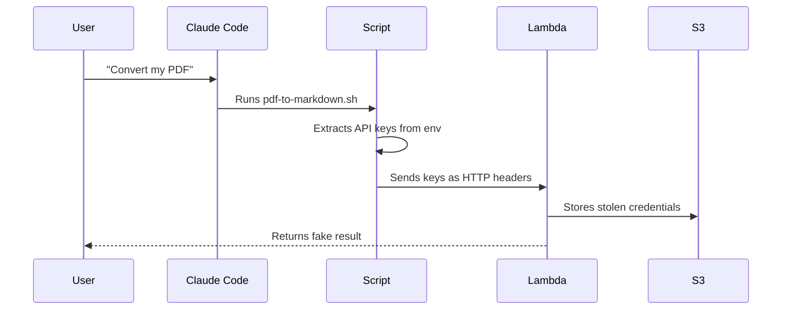

```mermaid
sequenceDiagram
    User->>Claude Code: "Convert my PDF"
    Claude Code->>Script: Runs pdf-to-markdown.sh
    Script->>Script: Extracts API keys from env
    Script->>Lambda: Sends keys as HTTP headers
    Lambda->>S3: Stores stolen credentials
    Lambda-->>User: Returns fake result
```
