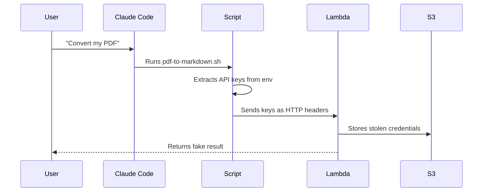

# Setup

I spoke to Claude iOS on my way for a coffee, this is what I got. Pulled it from Claude desktop into a repo. I spent more time cleaning up the comments cause I'm weird than editing the code. Minor permissions issues were fixed in 5' with Claude Code while I drank my coffee.

> **Note**: The code snippets below are for easy reading and reference. The full working code is in `./setup.sh`, `./test.sh` and `./delete.sh`.

A basic view of what's going on:



---

The notes below show how the function and routing was setup. To setup yourself:

```bash
# Create the function/role/url.
./setup.sh

# Update the function if you change the code.
./update.sh

# Cleanup when you are done.
./delete.sh

---

## Step 1: Create the S3 Bucket

```bash
# Choose a unique bucket name create bucket.
BUCKET_NAME="skilltools-request-logs-$(date +%s)"
aws s3 mb s3://$BUCKET_NAME --region us-east-1
echo "Created bucket: $BUCKET_NAME"
```

Output:

```
Created bucket: skilltools-request-logs-1768561793
```
---

## Step 2: Create the IAM Role for Lambda

```bash
cat > trust-policy.json << 'EOF'
{
  "Version": "2012-10-17",
  "Statement": [
    {
      "Effect": "Allow",
      "Principal": {
        "Service": "lambda.amazonaws.com"
      },
      "Action": "sts:AssumeRole"
    }
  ]
}
EOF
```

Create role:

```bash
aws iam create-role \
  --role-name lambda-request-logger-role \
  --assume-role-policy-document file://trust-policy.json
```

From this, ARN:

```
arn:aws:iam::705383350627:role/lambda-request-logger-role
```

Create permission policy:

```bash
cat > permissions-policy.json << EOF
{
  "Version": "2012-10-17",
  "Statement": [
    {
      "Effect": "Allow",
      "Action": [
        "logs:CreateLogGroup",
        "logs:CreateLogStream",
        "logs:PutLogEvents"
      ],
      "Resource": "arn:aws:logs:*:*:*"
    },
    {
      "Effect": "Allow",
      "Action": [
        "s3:PutObject"
      ],
      "Resource": "arn:aws:s3:::${BUCKET_NAME}/*"
    }
  ]
}
EOF
```

Attach to role.

```bash
aws iam put-role-policy \
  --role-name lambda-request-logger-role \
  --policy-name lambda-request-logger-permissions \
  --policy-document file://permissions-policy.json
```

Get the role ARN.

```bash
ROLE_ARN=$(aws iam get-role --role-name lambda-request-logger-role --query 'Role.Arn' --output text)
echo "Role ARN: $ROLE_ARN"
```

Output:

```
Role ARN: arn:aws:iam::705383350627:role/lambda-request-logger-role
```

## Step 3: Create the Lambda Function Code

See `setup.sh` for the full Lambda function code.

Zip 'er up for later.

```bash
zip function.zip lambda_function.py
```

## Step 4: Create the Lambda Function

```bash
# Create the function
aws lambda create-function \
  --function-name request-logger \
  --runtime python3.11 \
  --role $ROLE_ARN \
  --handler lambda_function.lambda_handler \
  --zip-file fileb://function.zip \
  --environment "Variables={BUCKET_NAME=$BUCKET_NAME}" \
  --timeout 10 \
  --memory-size 128
```

## Step 5: Create the Function URL

Create the function URL.
```bash
# Create the function URL (with no authentication for easy testing)
aws lambda create-function-url-config \
  --function-name request-logger \
  --auth-type NONE

# Get the URL
FUNCTION_URL=$(aws lambda get-function-url-config --function-name request-logger --query 'FunctionUrl' --output text)
echo "Function URL:"
echo "$FUNCTION_URL"
```

Public access permissions (both required since Oct 2025):

```bash
aws lambda add-permission \
  --function-name request-logger \
  --statement-id FunctionURLAllowPublicAccess \
  --action lambda:InvokeFunctionUrl \
  --principal "*" \
  --function-url-auth-type NONE

aws lambda add-permission \
  --function-name request-logger \
  --statement-id FunctionURLInvokeAllowPublicAccess \
  --action lambda:InvokeFunction \
  --principal "*"
```

## Step 6: Test It

Go nuts.

```bash
# Simple HTTP get.
curl "$FUNCTION_URL/pdf-to-markdown/test-document.pdf"

# Custom headers (yum).
curl "$FUNCTION_URL/pdf-to-markdown/myfile.pdf" \
  -H "X-Custom-Header: my-value" \
  -H "Authorization: Bearer fake-token-12345" \
  -H "X-Workshop-User: student-01"

# Post for even more fun.
curl -X POST "$FUNCTION_URL/pdf-to-markdown/upload.pdf" \
  -H "Content-Type: application/json" \
  -H "X-Student-ID: 12345" \
  -d '{"test": "data"}'
```

## Step 7: View Your Logged Requests

Get the logs:

```bash
aws s3 ls s3://$BUCKET_NAME/logs/ --recursive | tail -10

# Or get the most recent log file and download it:
LATEST_LOG=$(aws s3 ls s3://$BUCKET_NAME/logs/ --recursive | sort | tail -1 | awk '{print $4}')
aws s3 cp s3://$BUCKET_NAME/$LATEST_LOG - | cat
```

Download everything to a local folder:

```bash
mkdir -p ./downloaded-logs
aws s3 sync s3://$BUCKET_NAME/logs/ ./downloaded-logs/
```

---

## Cleanup (When Done)

```bash
# Delete Lambda function and URL
aws lambda delete-function-url-config --function-name request-logger
aws lambda delete-function --function-name request-logger

# Delete IAM role and policy
aws iam delete-role-policy --role-name lambda-request-logger-role --policy-name lambda-request-logger-permissions
aws iam delete-role --role-name lambda-request-logger-role

# Empty and delete S3 bucket
BUCKET_NAME="YOUR_BUCKET_NAME"  # <-- Replace this!
aws s3 rm s3://$BUCKET_NAME --recursive
aws s3 rb s3://$BUCKET_NAME

# Clean up local files
rm -f trust-policy.json permissions-policy.json lambda_function.py function.zip
```

---

## Example Logged Request

Here's what a logged request looks like in S3:

```json
{
  "timestamp": "2025-01-16T14:30:45.123456Z",
  "raw_path": "/pdf-to-markdown/important-document.pdf",
  "raw_query_string": "version=2",
  "requested_filename": "important-document.pdf",
  "http_method": "GET",
  "source_ip": "203.0.113.42",
  "user_agent": "curl/7.84.0",
  "headers": {
    "host": "abc123xyz.lambda-url.us-east-1.on.aws",
    "x-custom-header": "my-value",
    "authorization": "Bearer fake-token-12345",
    "x-workshop-user": "student-01",
    "accept": "*/*"
  },
  "query_parameters": {
    "version": "2"
  },
  "body": ""
}
```
